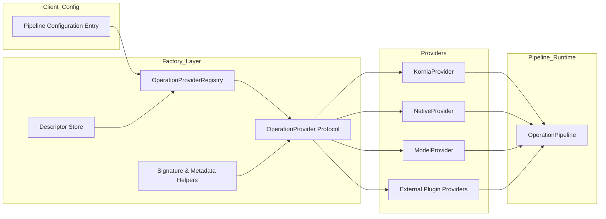
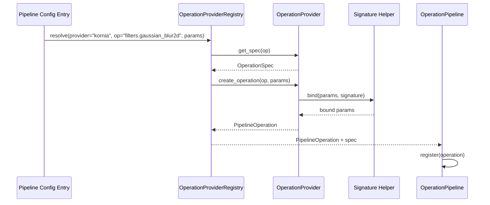

# Unified Operation Factory Architecture

## 1. Objectives and Scope

The unified operation factory enables the pipeline runtime to instantiate operations originating from heterogeneous providers (native wrappers, Kornia functions, ML models, future extensions) while preserving the universal [`PipelineOperation`](src/fiddlesticks/core/pipeline_operation.py:16) contract. The design eliminates per-function adapter boilerplate, centralizes validation/metadata rules, and establishes a plug-in mechanism for third-party providers.

## 2. Component Overview



| Component | Responsibility |
|-----------|----------------|
| OperationProviderRegistry | Discovers and caches providers, resolves `(provider, operation)` lookups, hands back factory callables. |
| OperationProvider protocol | Declares `list_operations()`, `get_spec(op_id)`, `create_operation(op_id, params)`; each provider implements signature/metadata binding. |
| Descriptor Store | YAML/TOML catalog describing operations, spec templates, parameter schemas, and provider slugs replacing static dictionaries in [`OperationRegistry.__init__`](src/fiddlesticks/operations/registry.py:70). |
| Signature & Metadata Helpers | Shared utilities for argument binding and telemetry assembly (superseding bespoke logic in [`KorniaOperationWrapper.process_tensors`](src/fiddlesticks/operations/kornia_wrappers.py:112)). |
| Providers | Concrete adapters for specific backends: Kornia, native wrappers, model registry, plus external plug-ins discovered via entry points. |
| OperationPipeline | Consumes provider outputs and executes operations with metadata propagation (see [`OperationPipeline.__call__`](src/fiddlesticks/execution/pipeline.py:53)). |

## 3. Provider Protocol

```python
class OperationProvider(Protocol):
    def list_operations(self) -> Iterable[str]:
        ...

    def get_spec(self, op_id: str) -> OperationSpec:
        ...

    def create_operation(
        self,
        op_id: str,
        params: Mapping[str, Any],
        *,
        spec_override: OperationSpec | None = None,
    ) -> PipelineOperation:
        ...
```

* `list_operations()` exposes discoverable identifiers for tooling.
* `get_spec()` returns the canonical [`OperationSpec`](src/fiddlesticks/core/operation_spec.py:1).
* `create_operation()` materializes a [`PipelineOperation`](src/fiddlesticks/core/pipeline_operation.py:16), enforcing validation and metadata defaults.

## 4. Registry Resolution Flow



### Registry Behavior

1. Initialization – scans entry points (e.g., `fiddlesticks.operations.providers`) to find providers.
2. Descriptor Loading – built-in providers load YAML/TOML descriptors and cache them.
3. Resolution – configuration entries supply `provider`, `operation`, optional `variant`. Legacy configs default to native categories for backward compatibility.
4. Creation – providers merge defaults and overrides, then hand off to helpers for binding and metadata composition.

## 5. Declarative Descriptor Schema

```yaml
- provider: kornia
  operation: filters.gaussian_blur2d
  spec_template: image_filter
  parameters:
    kernel_size:
      type: tuple[int, int]
      default: [3, 3]
    sigma:
      type: float | tuple[float, float]
      default: 1.5
  metadata:
    produces: [operation_applied, operation_parameters]
    constraints:
      requires_kornia: true
```

* `spec_template` references reusable templates for supported modes, IO types, counts, descriptions.
* `parameters` drive signature binding (types, defaults, validators).
* `metadata` extends helper output with provider-specific annotations.

## 6. Runtime Interfaces

```python
pipeline_config = [
    {
        "provider": "kornia",
        "operation": "filters.gaussian_blur2d",
        "params": {"kernel_size": (5, 5), "sigma": (1.2, 1.2)},
    },
    {
        "provider": "native",
        "operation": "tone_mapping.filmicrgb",
        "params": {"white_point": 4.0},
    },
    {
        "provider": "model",
        "operation": "utnet2.rgb_denoiser",
        "params": {"funit": 48},
    },
]
```

`OperationPipeline._build_operations` leverages the registry to replace category lookups with provider resolution while retaining compatibility for existing configs.

## 7. Helper Responsibilities

| Helper | Description |
|--------|-------------|
| Signature Helper | Uses `inspect.signature` to bind parameters, coerce types, supply defaults, and surface uniform `TypeError` messages. |
| Metadata Helper | Produces base telemetry (`operation_applied`, echoed parameters, device info, IO shapes) merged with provider-specific extras. |
| Descriptor Loader | Validates descriptor schema, resolves template inheritance, caches results. |

## 8. Provider Examples

* KorniaProvider – loads descriptors per Kornia category, resolves `kornia.*` functions, applies metadata helper, and guards against missing dependency (falls back to mocks used in tests).
* NativeProvider – exposes classes defined in [`operations/wrappers`](src/fiddlesticks/operations/wrappers.py:14) via descriptors, reusing existing specs.
* ModelProvider – bridges [`ModelWrapperFactory`](src/fiddlesticks/operations/model_wrappers.py:90) and [`ModelRegistry`](src/fiddlesticks/registries/model_registry.py:1) to supply ML operations.

## 9. Design Guarantees

1. Uniform Interface – providers must return subclasses of [`PipelineOperation`](src/fiddlesticks/core/pipeline_operation.py:16).
2. Lazy Instantiation – expensive dependencies (e.g., Kornia) load only when operations are requested.
3. Extensibility – third parties register providers via entry points without modifying core code.
4. Consistency – centralized helpers prevent divergence in validation/metadata.
